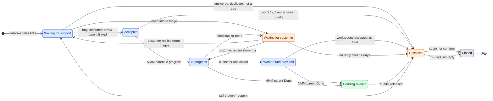
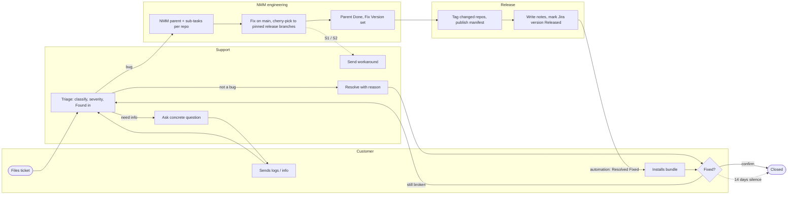
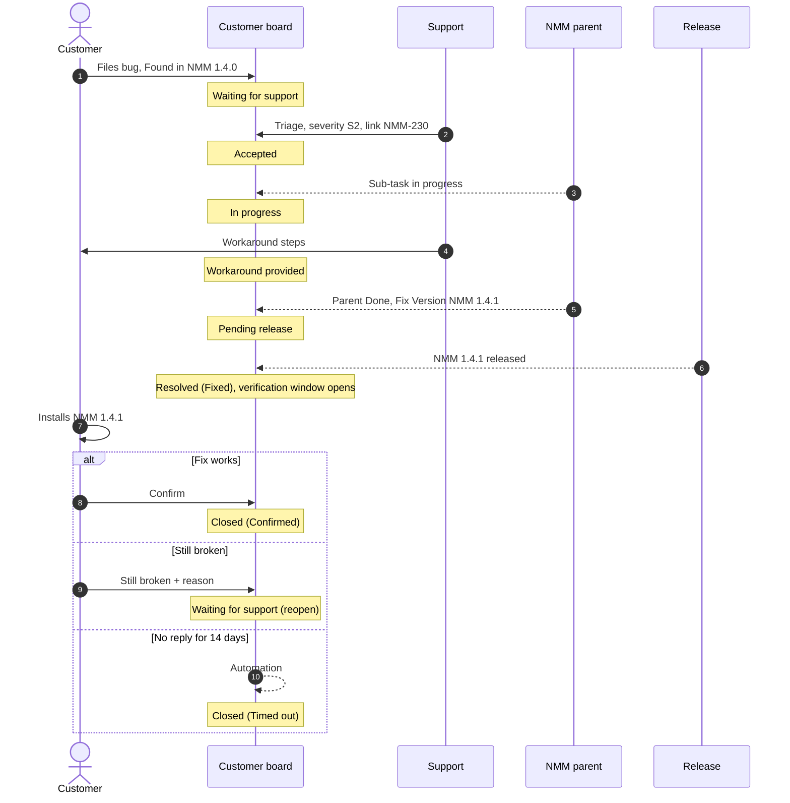
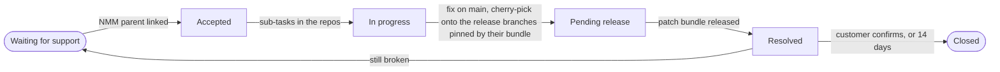

# NMM development lifecycle

How the NMM product moves from a Jira ticket to a shipped bundle, and how a customer bug gets a status the customer can see.

NMM is five independently versioned repositories that ship together:

```
customer  →  frontend  →  BFF  →  core1
                              →  core2
                              →  core3
```

| Repo | Role |
| --- | --- |
| **frontend** | What the user sees. Calls only the BFF. |
| **bff** | Backend for frontend. The only caller of the cores. |
| **core1, core2, core3** | Core services consumed by the BFF. |

Each repo uses **Option A** from [RELEASE_VERSIONING.md](./RELEASE_VERSIONING.md): `main`, `release/X.Y` while that component line is supported, tags `vX.Y.Z`, fix on `main`, cherry-pick onto the release branch. This document does not change that. It adds the two things Option A does not cover:

1. **Customer tickets.** A second Jira board, owned by the customer, whose status must move when NMM work moves.
2. **The bundle.** The product version that pins one tag from each repo and is the only version customers and the customer board understand.

---

## Two versions, on purpose

A component version and a bundle version are different clocks. Do not collapse them into one number.

| | Component version | Bundle version |
| --- | --- | --- |
| Example | `frontend 2.3.1`, `bff 4.1.0`, `core2 3.0.1` | `NMM 1.4.0`, `NMM 1.4.1` |
| Where it lives | Git tag in that repo | Bundle manifest + Jira Fix Version |
| Who sees it | Engineers | Customers, support, the customer Jira board |
| Branch | `release/2.3` in the frontend repo | No Git branch. A manifest that points at five tags |
| When it bumps | That repo changed | The set of tags we ship changed |

`NMM 1.4.0` might pin `frontend 2.3.0`, `bff 4.1.0`, `core1 1.8.0`, `core2 3.0.1`, `core3 0.9.4`. The next patch bundle, `NMM 1.4.1`, might bump only `core1` and `bff` and repeat the other three tags unchanged.

Customers never need a core version. Support answers “which NMM are you on?” Engineers answer “which tag of core1 is inside that NMM?”

### Manifest

The bundle is a bill of materials, not a sixth codebase. Tag it the same way you tag a component: an immutable name for one exact set.

```yaml
bundle: 1.4.1
components:
  frontend: v2.3.0
  bff: v4.1.2
  core1: v1.8.1
  core2: v3.0.1
  core3: v0.9.4
```

Keep the manifest in a thin release record (a small repo, or the body of a GitHub Release named `nmm-v1.4.1`). The record is the source of truth for “what we shipped as NMM 1.4.1.” Jira Fix Version `NMM 1.4.1` is the same name, used so tickets can be released in bulk.

Do not create `release/1.4` in every repo just because the bundle is 1.4. Each repo’s release branch follows **that repo’s** SemVer (`frontend` stays on `release/2.3`). The manifest is the join.

---

## Jira

Two boards. One direction of status.

| Board | Who uses it | What is filed there |
| --- | --- | --- |
| **NMM** | This team | User stories, tasks, engineering bugs |
| **Customer** | The customer (and support) | Customer bugs |

Engineering does not implement on the customer board. The customer does not move NMM tickets. An NMM ticket **fixes** a customer ticket. Status on the customer ticket is a projection of that link, written by Jira Automation (or, until automation exists, by the person who transitions the NMM parent).

### NMM board

Keep the current shape.

| Issue type | Means | Done when |
| --- | --- | --- |
| **User story** | A product outcome. Usually a frontend feature. | Every child task is in the component tags pinned by a **released** bundle |
| **Task** | Work in one repo, linked to the story | The change is on that repo’s `main` and, once the bundle has been cut, on the release branch the bundle will tag |
| **Bug** | An engineering defect, including the parent opened for a customer bug | Same as a task, across every repo the bug actually touches |

A story that only changes the frontend still gets a frontend task. The story is the outcome; the task is the repo. A story that also needs the BFF and one core gets one task per repo that must change. Repos that do not change get no task.

The story does not close when the frontend PR merges. It closes when every child task has landed on the tag the bundle pins, and that bundle version is released in Jira.

Every story, task, and engineering bug that belongs in a train carries Fix Version = the bundle (`NMM 1.4.0`, `NMM 1.4.1`, …). Component versions stay in Git. They are not a second Jira version list.

Release notes do not read tasks. They read the story or the parent bug. A task is how a repo changes; the parent is the change a customer can understand.

### Customer board

A customer bug needs these fields or it cannot be routed:

| Field | Required | Use |
| --- | --- | --- |
| **Found in** | Yes | The bundle the customer is running (`NMM 1.4.0`). This chooses which component release branches are eligible for a backport. |
| **Severity** | Yes, set at triage | S1–S4 (below). Decides the response targets and whether the fix waits for the next patch bundle. |
| **Link** | Yes, once accepted | One NMM bug that **fixes** this customer bug |
| **Fix Version** | Once the target bundle is known | The bundle that will contain the fix (`NMM 1.4.1`) |
| **Status** | Always | The workflow below. Nothing else. |
| **Resolution** | Required on Resolved | Why the ticket closed (below) |

One customer bug → **one** NMM parent. If the fix spans core1 and the BFF, those are sub-tasks of that parent (or tasks linked to it), not five peer tickets on the customer issue. Customer status follows the parent. With several peers, the customer ticket has no single status, which is the gap today.

### Severity

| Severity | Meaning | First response | Fix route |
| --- | --- | --- | --- |
| **S1** | Production down or data loss, no workaround | 1 hour | Mitigate first, then an out-of-band patch bundle |
| **S2** | Major function broken, workaround is painful | 4 business hours | Next patch bundle, or out-of-band if the customer cannot wait |
| **S3** | Function wrong, workaround exists | 1 business day | Next patch bundle |
| **S4** | Cosmetic, or a question | 2 business days | Backlog. Often the next feature bundle rather than a patch. |

The times are starting values. Put the agreed ones in the customer contract and keep this table in sync with it.

Severity describes the customer’s situation today, so it changes when that changes. A workaround that restores service turns an S1 into an S2 or S3. Record every change in a public comment.

### Customer workflow

Main path: **Waiting for support → Accepted → In progress → Pending release → Resolved → Closed.** The NMM parent drives it up to Resolved. The customer’s verification ends it.

Two side statuses: **Waiting for customer** and **Workaround provided.** Support sets them by hand. They describe the conversation, not the code.

**Waiting for support** and **Waiting for customer** are the pair that says who has the ball. They are the Jira Service Management defaults, and the names already used on the customer board.

The flow has four phases:

| Phase | Statuses | Who has the ball |
| --- | --- | --- |
| **Triage** | Waiting for support | Support |
| **Fix** | Accepted, In progress, Workaround provided | Engineering |
| **Delivery** | Pending release | Release (patch bundle schedule) |
| **Verification** | Resolved → Closed | Customer |

Waiting for customer can interrupt triage or fix. It hands the ball to the customer until they reply.

#### Status flow

Colour shows who has to act next: blue = us, orange = customer, green = release, grey = finished.



Resolved is orange: the ticket is back with the customer, to confirm or reopen.

#### Who does what, end to end



#### Happy path, with verification



| Status | Meaning for the customer | Entry condition | Set by |
| --- | --- | --- | --- |
| **Waiting for support** | We received it; it is with us. | The customer filed it, replied from Waiting for customer before triage finished, or reopened it with Still broken | Customer, automation |
| **Accepted** | Confirmed defect, and we own it. | Triage classified it as a bug, set severity, and linked one NMM parent with **fixes** | Support (automation on link) |
| **In progress** | Engineering is working on it. | Any NMM sub-task is in progress | Automation from the NMM parent |
| **Workaround provided** | You are unblocked. The permanent fix is still coming. | A workaround was sent and the customer confirmed it works | Support, by hand |
| **Waiting for customer** | We need something from you. | A specific question was asked: logs, reproduction steps, bundle version, access | Support, by hand |
| **Pending release** | Fixed, and scheduled for `NMM 1.4.1`. | Every required repo change is merged on the release line the bundle will tag; NMM parent Done; Fix Version set | Automation from the NMM parent |
| **Resolved** | We consider this done. Please verify. | The bundle is released, or triage decided no code change | Automation (release) or support |
| **Closed** | Final. | The customer confirmed, or 14 days passed in Resolved without a reply | Customer, automation |

Do not copy internal states onto the customer ticket (in review, cherry-pick, waiting on core2). Those stay on the NMM sub-tasks.

#### Waiting for customer

Shows who has the ball. Without it, a ticket waiting for logs looks like engineering is slow.

- **Enter only with a concrete ask.** The public comment says exactly what is needed (“attach BFF logs for 22 Sep, 14:00–15:00, and confirm your bundle version”). “Please provide more info” does not qualify.
- **The clocks pause.** Time here does not count against first response, restore, or fix targets. That is why the ask must be concrete; otherwise the status is a way to hide delay.
- **Return is automatic.** When the customer comments, automation moves the ticket back to the status it came from, stored in a hidden **Previous status** field when the ticket entered Waiting. Waiting for support if it came from triage, In progress if it came from engineering.
- **Reminders, then resolve.** Remind after 3 business days and again after 7. After 14, resolve with **No response**. The normal verification window follows, so the customer can still reopen.
- **Flag the NMM side.** The NMM parent or sub-task gets the Jira flag (or a `blocked-customer-info` label), so the sprint board shows why nothing moves. The NMM status itself does not change.
- **Allowed from Waiting for support and In progress only.** Once the fix is merged (Pending release), you need nothing from the customer. Verification happens after Resolved.

#### Workaround provided

Separates “the customer is unblocked” from “the defect is fixed.” For S1 and S2 those are different moments, and the first one matters most to the customer.

- **Not terminal.** The NMM parent stays open and the fix continues. When the parent reaches Done, the ticket moves to Pending release as usual.
- **Re-evaluate severity.** S1 means no workaround. Entering this status normally lowers S1 to S2 or S3, and the fix moves from an out-of-band bundle to the next patch bundle. Say so in the comment.
- **Stops the restore clock** (see [Clocks](#clocks)).
- **Write the workaround down.** Steps in a public comment and on the NMM parent. If it applies to other customers, add it to the known issues for that bundle.
- **Can end the ticket.** If the customer accepts the workaround as permanent and product decides not to fix, resolve with **Workaround**. Close the NMM parent as Won’t fix, with a link.

### Resolutions

Resolved alone tells the customer nothing. The resolution is required.

| Resolution | When |
| --- | --- |
| **Fixed** | The bundle in Fix Version is released |
| **Fixed in newer bundle** | Already fixed in a bundle they do not run. The comment names the bundle to upgrade to. |
| **Workaround** | Workaround accepted as final, no code fix |
| **Answered** | A question or a configuration issue |
| **Won’t fix** | Outside the support window, or a product decision. The comment gives the reason. |
| **Duplicate** | Linked to the original customer ticket, which carries the status |
| **Cannot reproduce** | Tried with the information provided. The comment says what was tried. |
| **No response** | Waiting for customer timed out |

### Verification

**We resolve. The customer verifies.** Customer confirmation is not the gate for Resolved:

- Many customers never reply. If closing waited for them, tickets would stay open for months and the open count would mean nothing.
- Released is not installed. A customer may take weeks to install `NMM 1.4.1`. Our part ends when the fix is available on their line.
- The clocks need a stop that we control. Time to delivery ends at the release, not at the customer’s upgrade window.

So the ending has two steps. **Resolved** is our statement: done, please verify. **Closed** is final, and it is reached only through the customer or the timeout.

While a ticket is Resolved, the customer has two actions on the portal:

| Action | Ticket moves to | Also |
| --- | --- | --- |
| **Confirm** | Closed | Customer confirmation = Confirmed |
| **Still broken** | Waiting for support | A reason comment is required. Customer confirmation = Reopened. The reopen count goes up. |

With no action, the ticket stays Resolved. Automation sends a reminder on day 7 and moves it to **Closed** on day 14 with Customer confirmation = Timed out.

The window applies to every resolution, not only Fixed. A customer can dispute Answered, Won’t fix, or Cannot reproduce the same way. Support then either explains again and resolves again, or reopens the investigation.

**Handling Still broken:**

| Support finds | NMM side | Customer ticket |
| --- | --- | --- |
| Same defect, fix incomplete | Reopen the NMM parent. New sub-tasks as needed. Fix Version = next patch bundle. | Follows the main path again: Accepted → In progress → … |
| Different defect | New NMM bug linked **fixes**. The old parent stays Done. | Same ticket, new link. Main path again. |
| Fix works, customer’s install or config is wrong | None | Resolved (Answered), with the steps. The window opens again. |
| Customer has not installed the bundle | None | Resolved again, with the bundle id and install pointer. |

**After Closed,** the ticket cannot be reopened. A new problem means a new ticket, linked to the closed one with **relates to**. That keeps Closed a real end state for reporting.

**S1 and S2 get active verification.** When the bundle is released, the resolution comment asks explicitly: “Fixed in `NMM 1.4.1`. Please confirm after installing.” Support follows up when the customer reports the upgrade. The ticket is still Resolved on release, so the clocks stop the same way. Only the follow-up is more hands-on.

**What verification measures:**

- **Confirmation rate:** Confirmed ÷ (Confirmed + Timed out). How often customers actually tell us.
- **Reopen rate:** Resolved tickets that came back with Still broken. For Fixed, each one is an escaped fix. This is the most important quality signal in the workflow.
- Optional: a satisfaction survey sent on Closed. Jira Service Management has one built in.

### Clocks

| Clock | Starts | Paused in | Stops | Owner |
| --- | --- | --- | --- | --- |
| **First response** | Waiting for support | Waiting for customer | First public comment from support, or Accepted | Support |
| **Time to restore** (S1, S2) | Waiting for support | Waiting for customer | Workaround provided or Pending release, whichever comes first | Support + engineering |
| **Time to fix** | Accepted | Waiting for customer | Pending release | Engineering |
| **Time to delivery** | Pending release | — | Resolved | Release (patch bundle schedule) |

Fix and delivery are separate on purpose. A week in Pending release is the patch bundle schedule, not an engineering delay. You want both numbers, not one blurred total.

No clock runs on us during verification. The 14 days in Resolved are the customer’s window.

A reopen (Still broken) starts a new cycle of every clock, from Waiting for support. Report reopened cycles separately so one bad fix does not hide inside the average of first attempts.

### Status sync

Engineering progress flows one way: NMM → customer, on the link type **fixes**. The two side statuses are the exception. Support sets them on the customer board, because they describe the conversation, not the code.

| Transition | Driver |
| --- | --- |
| → Accepted, → In progress, → Pending release, → Resolved (Fixed) | Automation from the NMM parent and from releasing the Jira version |
| → Waiting for customer, → Workaround provided, → Resolved (any other resolution) | Support, by hand, always with a public comment |
| Waiting for customer → previous status | Automation, when the customer comments |
| Resolved → Closed (Confirm), Resolved → Waiting for support (Still broken) | Customer, on the portal |
| Resolved → Closed after 14 days | Automation |

| NMM parent moves to | Customer ticket becomes | Also |
| --- | --- | --- |
| Created and linked | **Accepted** | Comment with the NMM key |
| In progress | **In progress** | — |
| Done, Fix Version not yet released | **Pending release** | Copy Fix Version onto the customer ticket |
| Fix Version released in Jira | **Resolved (Fixed)** | Comment: bundle id, and which component tags changed |
| Won’t fix / Duplicate / Cannot reproduce | **Resolved** with that resolution | Comment with the reason. If it already exists in a newer bundle, name that bundle. |

Two guard rules on the sync:

1. A customer ticket in **Waiting for customer** ignores NMM parent transitions. When the customer replies, the ticket returns to its previous status, and the next parent transition catches it up.
2. A customer ticket in **Workaround provided** ignores every NMM parent transition except Done.

“Code is on `main`” is not Resolved. The customer is on a bundle. The ticket is resolved when **their line** has a released bundle that contains the fix, or when you have told them the line is unsupported and named the upgrade.

Releasing a Jira version is the switch. When `NMM 1.4.1` is marked Released, every customer ticket (and every NMM story) with that Fix Version can transition together. That is the status that is missing today: the customer ticket never hears that the bundle shipped.

Until automation is in place, the person who sets the NMM parent to Done sets the customer ticket to Pending release and copies the Fix Version. The person who publishes the bundle marks the Jira version Released and resolves the linked customer tickets. Do not leave that as an optional comment.

### Triage outcomes that still must write back

| Outcome | Customer status | NMM work |
| --- | --- | --- |
| Will fix on their line | Accepted → the normal path | Parent + sub-tasks, Fix Version = next patch bundle on that line |
| Already fixed in a newer bundle they do not run | Resolved (Fixed in newer bundle) | Comment “upgrade to NMM x.y.z”. No new code. |
| Their bundle is outside the support window | Resolved (Won’t fix) | Fix only on `main` and on supported lines. Point them at the oldest supported bundle that contains it. |
| Question or configuration issue | Resolved (Answered) | None. Never Accepted. |
| Cannot reproduce / duplicate / by design | Resolved with that resolution | No release branch work |

### Examples

**S1 outage, workaround first**

1. The customer reports that login fails for every user on `NMM 1.4.0`. **Waiting for support**, S1. First response and restore clocks start.
2. After 20 minutes, support confirms and links `NMM-210`. **Accepted**, then **In progress**.
3. After 1 hour, a config flag disables the failing SSO path and the customer confirms login works. **Workaround provided.** The restore target is met. Severity goes to S2.
4. The fix lands in core2 and the BFF, is cherry-picked, and `NMM-210` is Done with Fix Version `NMM 1.4.1`. **Pending release.**
5. `NMM 1.4.1` is released. **Resolved (Fixed).** The comment names the bundle, asks the customer to confirm after installing (S1 → active verification), and says the flag can be turned back on.
6. Four days later the customer installs, turns the flag back on, and clicks Confirm. **Closed (Confirmed).**

**S3 bug, missing information**

1. The customer reports a wrong total on a report. **Waiting for support**, S3.
2. Triage needs the bundle version and an example ID. **Waiting for customer.** Clocks pause.
3. The customer replies two days later. Automation returns the ticket to **Waiting for support**. Clocks resume.
4. Reproduced and linked to `NMM-230`. **Accepted**, then **In progress**.
5. The engineer needs production logs. **Waiting for customer** again. The NMM sub-task is flagged.
6. Reminders on day 3 and day 7, no reply. Day 14: **Resolved (No response).** The verification window opens.
7. Ten days later, the customer clicks Still broken and attaches the logs. **Waiting for support**, a new clock cycle, and triage continues from where it stopped.

**S3 fix that did not work**

1. `NMM-240` fixes a rounding error in core1. `NMM 1.4.2` is released. **Resolved (Fixed).**
2. The customer installs it and still sees wrong totals for one currency. Still broken, with an example. **Waiting for support.** Reopen count = 1.
3. Support reproduces it: same defect, the fix missed one code path. `NMM-240` is reopened with a new core1 sub-task, Fix Version `NMM 1.4.3`. **Accepted → In progress → Pending release.**
4. `NMM 1.4.3` is released. **Resolved (Fixed).** No reply for 14 days. **Closed (Timed out).**

### Jira setup for the customer workflow

- Customer board workflow: keep **Waiting for support** and **Waiting for customer**. Add **Accepted**, **Workaround provided**, and **Pending release** in the “In progress” status category so they never count as done. **Resolved** and **Closed** are in the “Done” category.
- Resolution required on the transition to Resolved, with the list above. Clear it on Still broken.
- Portal transitions from Resolved, visible to the customer: **Confirm** (→ Closed) and **Still broken** (→ Waiting for support, comment required). No other customer transitions out of Resolved. None out of Closed.
- Fields: hidden **Previous status**, written on entry to Waiting for customer. **Customer confirmation** (Confirmed / Timed out / Reopened) and **Reopen count**, written by the verification transitions.
- Clocks: on Jira Service Management, define each SLA goal with the start, pause, and stop conditions from [Clocks](#clocks), and let a reopen start a new cycle. On plain Jira Software, use automation with date fields or a marketplace SLA app.
- Six automation rules:
  1. Customer comments while Waiting for customer → previous status.
  2. Waiting for customer reminders on business days 3 and 7, then Resolved (No response) on day 14.
  3. NMM parent transition → customer status, with the two guard rules.
  4. Jira version Released → Resolved (Fixed) for customer tickets with that Fix Version.
  5. Resolved for 7 days → reminder to confirm. Resolved for 14 days → Closed, Customer confirmation = Timed out.
  6. Still broken → increment Reopen count, clear Resolution, notify the support rotation.

---

## Lifecycle of a feature bundle

`NMM 1.4.0` is a feature bundle. `NMM 1.5.0` can already be in development on every repo’s `main` while 1.4 is freezing. Same rule as Option A, one level up.

```
planning → build on main → cut the repos that changed → stabilize → tag → publish the manifest
```

### 1. Planning

- The user story describes the outcome.
- Add a task per repo that must change. No task for a repo that stays on its current tag.
- Set Fix Version `NMM 1.4.0` on the story and on each task.
- A breaking change is a planning fact, not a surprise at tag time:
  - Breaking **core** API → the BFF task is in the same story and the same bundle.
  - Breaking **BFF** API → the frontend task is in the same story and the same bundle.
  - Additive change → only the repos that actually change.

### 2. Build

Each task is a normal pull request into that repo’s `main`. Feature work does not go onto a release branch. `main` of each repo is the next unreleased work, which may already be the *next* bundle if 1.4 has been cut.

The story stays In progress until every child task has merged.

### 3. Cut

When 1.4 is feature-complete, cut a release branch only in repos that will ship a **new** tag in this bundle:

```
frontend main ──cut──► release/2.3     tag later: v2.3.0
bff main      ──cut──► release/4.1     tag later: v4.1.0
core1         (unchanged — bundle keeps the previous tag, no cut)
```

After the cut, `main` is 1.5 work. Version bump and changelog for the component stay on that repo’s release branch (release-only commits, not cherry-picked back to `main`). See [RELEASE_VERSIONING.md](./RELEASE_VERSIONING.md).

A repo with no change since the previous bundle does not get a branch, a bump, or a new tag. The new manifest repeats the old tag.

### 4. Stabilize

QA runs against the candidate set: the new release branches plus the unchanged tags.

A bug found here is fixed on that repo’s `main` first, then cherry-picked onto the release branch this bundle is tagging. Open the cherry-pick as a PR. Do not merge the release branch back to `main`.

If the fix is release-only in the mechanical sense (version bump, changelog), it stays on the release branch. Product fixes do not.

### 5. Tag and publish

1. Tag each repo that changed (`v2.3.0`, `v4.1.0`, …) and publish the GitHub Release. The API repo’s GitHub Release carries that component’s own changelog (see [Release notes](#release-notes)).
2. Write the manifest with those tags and the repeated unchanged tags. Publish it as `nmm-v1.4.0`.
3. Compose the bundle release notes into the Jira version description, from stories and parent bugs in that Fix Version.
4. Mark Jira version `NMM 1.4.0` Released.
5. Stories and tasks in that version move to Done. Customer tickets in that version move to Resolved, with a comment that names the bundle and links the release notes. Their verification window opens.

### What each repo is doing during one bundle

| Moment | Repo that changes in this bundle | Repo that does not |
| --- | --- | --- |
| Build | PRs to `main` | Untouched |
| Cut | `release/X.Y` from `main` | No branch |
| Stabilize | Cherry-picks onto `release/X.Y` | Untouched |
| Ship | New tag, listed in the manifest | Previous tag listed again |
| After ship | Branch stays while that component line is inside a supported bundle | Nothing to delete |

---

## Lifecycle of a customer bug

A customer bug is a patch bundle on the line they are running, unless triage says otherwise.



### Which branches get the fix

Found in `NMM 1.4.0` means: look at **that manifest**, and patch the component release branches it pins. Not “whatever `main` is,” and not a branch named `release/1.4` in every repo.

Example. Manifest for `NMM 1.4.0`:

```yaml
frontend: v2.3.0    # branch release/2.3
bff:      v4.1.0    # branch release/4.1
core1:    v1.8.0    # branch release/1.8
core2:    v3.0.1
core3:    v0.9.4
```

The bug is in core1 and needs a BFF change. frontend, core2, and core3 are innocent.

1. Open NMM bug `NMM-100` linked **fixes** the customer bug. Sub-tasks: core1, bff. Customer → Accepted, then In progress.
2. Fix core1 on `main`, then cherry-pick onto `release/1.8`. Tag `v1.8.1`.
3. Fix bff on `main`, then cherry-pick onto `release/4.1`. Tag `v4.1.1`.
4. If a newer bundle line is already cut (`NMM 1.5` still stabilizing, or already shipped), cherry-pick onto those component release branches too, newest supported line first. `main` already has the fix, so the next feature bundle is covered.
5. Publish manifest `NMM 1.4.1`:

```yaml
bundle: 1.4.1
components:
  frontend: v2.3.0   # unchanged
  bff: v4.1.1        # patched
  core1: v1.8.1      # patched
  core2: v3.0.1      # unchanged
  core3: v0.9.4      # unchanged
```

6. Set Fix Version `NMM 1.4.1` on the NMM parent and on the customer ticket. Parent Done → customer **Pending release**.
7. Mark `NMM 1.4.1` Released → customer **Resolved**. Comment: `Fixed in NMM 1.4.1 (bff v4.1.1, core1 v1.8.1). Please confirm after installing.`
8. The customer confirms → **Closed**. Or clicks Still broken → back to Waiting for support. Or stays silent for 14 days → **Closed (Timed out)**.

If the same fix must also ship as `NMM 1.5.1` because 1.5.0 already went out without it, that is a second Fix Version (or a second customer-facing note), produced by the cherry-pick onto the 1.5 component branches. One code fix, one bundle entry per line you still support.

### Support window

Write the window down and apply it to **bundles**, not to every component minor independently.

| Line | Patches |
| --- | --- |
| Current bundle minor (`1.5.x` while 1.5 is current) | Fixes |
| Previous bundle minor (`1.4.x`) | Security and critical bugs |
| Older | No patch. Customer ticket resolves as upgrade. |

A component release branch is deleted when no supported bundle still pins a tag on that line. Tags stay. This is the same delete rule as Option A; the bundle manifest is how you know the line is still in use.

---

## Compatibility inside a bundle

The manifest is a known-good set: the pinned frontend works with the pinned BFF, and the pinned BFF works with the pinned cores. A tag does not enter a bundle unless every consumer **in that same manifest** can call it.

| Change | Ships in the same bundle as |
| --- | --- |
| Additive core API | Core only, if the current BFF tolerates it |
| Breaking core API | Updated BFF |
| Additive BFF API | BFF only, if the current frontend tolerates it |
| Breaking BFF API | Updated frontend |

Deploy a bundle in dependency order when the services are rolled rather than installed as one atomic unit:

1. cores
2. bff
3. frontend

During a rolling deploy, two versions of a service can be alive for a short time. Schema and API changes still follow expand → switch → contract from [RELEASE_VERSIONING.md](./RELEASE_VERSIONING.md). A patch bundle must not contain a contract step (drop a column, remove a field) that the previous bundle’s binaries still need, unless you accept downtime.

Frontend speaks only to the BFF. Cores are not a second client API for the frontend.

---

## Release notes

Two note streams. They answer different questions, so they are not copies of each other.

| Note | Audience | Question it answers | Where it lives |
| --- | --- | --- | --- |
| **Bundle notes** | Customers, support, the customer board | What changed in NMM since the previous bundle on this line? | Jira version description for `NMM x.y.z` |
| **API notes** | Customers who call the API | What changed in the API contract since the previous API tag? | GitHub Release on the API repo (the BFF, if that is the API they call) |
| **Other component notes** | This team | What landed in core1 `v1.8.1`? | GitHub Release on that repo. Not sent to the customer. |

Customers who integrate against the API cannot use the bundle note alone. `NMM 1.4.1` also contains frontend work they do not run. Their upgrade decision is SemVer on the API: additive, deprecated, or breaking since the tag they have pinned. That is why the API repo keeps its own notes. core1, core2, and core3 do not. A customer never calls them. When a core change is visible, it shows up as a bundle fix, and as an API note only if the BFF contract changed because of it.

Frontend does not get customer-facing component notes either. The bundle note already describes the feature.

### What “since the previous release” means

A release note is the set of issues whose Fix Version **is** this version. It is not a date range, and it is not “everything resolved while this version was open.” Two lines are in flight at once; a date query mixes 1.4 patches with 1.5 features.

| This note | Previous release | Jira / Git query |
| --- | --- | --- |
| Bundle `NMM 1.4.1` | `NMM 1.4.0` | `fixVersion = "NMM 1.4.1" AND type in (Story, Bug)` |
| Bundle `NMM 1.5.0` | `NMM 1.4.0` (the feature line) | `fixVersion = "NMM 1.5.0" AND type in (Story, Bug)` |
| API `v4.1.2` | previous API tag on that line (`v4.1.1` or `v4.1.0`) | GitHub Release for that tag, commits since the previous tag |

A bug that shipped in `1.4.0` and is fixed in `1.4.1` is a line in the `1.4.1` notes. If that fix is already on `main` before `1.5.0` is tagged, it is not also a `1.5.0` note: `1.5.0` never had the bug. If `1.5.0` already shipped without the fix, the bug’s Fix Versions are `NMM 1.4.1` and `NMM 1.5.1`, and it appears in both notes.

Tasks and sub-tasks stay out of both queries. They share the parent’s Fix Version so the board can filter a train; they are not entries.

### What a person writes on the ticket

On every story and every parent bug, before it can move to Done:

| Field | Required | Use |
| --- | --- | --- |
| **Release note** | Yes, if a customer should see it. Empty means internal, omit from notes. | One or two sentences in customer language. Not the implementation summary. |
| **API impact** | Yes, if any child task is on the API repo | `None`, `Additive`, `Deprecated`, or `Breaking` |
| **API migration** | Yes when API impact is Deprecated or Breaking | What the caller must change, and by which API version the old behavior disappears |

`API impact = None` on a BFF task means the code changed and the contract did not (a bugfix that keeps the same request and response). It still gets a bundle line when the release note is filled. It does not get an API-contract line.

### Bundle note (Jira)

Jira’s built-in release notes print issue keys and summaries. Summaries are for the team. Publish the **Release note** field instead.

Before marking the version Released, write this into the version description. Same text on the NMM version and the customer-board version, so both boards show one note.

```
## NMM 1.4.1

Changes since NMM 1.4.0.

### Features
- <Release note from each Story in this Fix Version>

### Fixes
- <Release note from each Bug in this Fix Version>
  Customer issues: <customer keys linked with "fixes">

### API
Since API v4.1.0 (this bundle pins v4.1.2).
- Additive — <API migration or release note>
- Breaking — <API migration>
Full API changelog: <link to the API GitHub Releases from v4.1.0 to the pinned tag>

### Included builds
frontend v2.3.0 (unchanged)
bff      v4.1.2
core1    v1.8.1
core2    v3.0.1 (unchanged)
core3    v0.9.4 (unchanged)
```

Omit a heading that has no issues. A patch with only fixes does not invent a Features section.

The API section is the contract delta **between the two manifests**, not the whole history of the API. If `NMM 1.4.0` pinned `bff v4.1.0` and `NMM 1.4.1` pins `bff v4.1.2`, the section contains `v4.1.1` and `v4.1.2`. If the BFF tag did not change, the API section says “API unchanged (`v4.1.0`)”.

Filter used to build it:

```
fixVersion = "NMM 1.4.1" AND type in (Story, Bug) AND "Release note" is not EMPTY
```

API lines are the subset where `API impact` is not `None`.

Mark the version Released only after that description is saved. Releasing is what resolves customer tickets; the description is what they read when it happens.

### API note (component)

On the API repo only, every tag gets a GitHub Release whose body is the changelog since the previous tag on that line. Group it the same way SemVer already implies:

- **Breaking** — major bump, or a breaking change you were forced to ship inside a minor (call it out at the top either way)
- **Deprecated** — still works, will be removed in a named later version
- **Additive** — new endpoint or optional field; old callers keep working
- **Fixes** — same contract, corrected behavior

This note exists even when the bundle note repeats the contract lines. An API consumer compares tags. They should not have to open an NMM version and subtract the frontend stories.

Cores and the frontend still get a GitHub Release for the team (what the tag contains, link to the PRs). That body is not copied into Jira and not linked from the customer ticket.

### Who writes which line

| Change | Bundle note | API note |
| --- | --- | --- |
| Frontend feature, API unchanged | Features | No |
| Customer bug fixed in a core, API contract unchanged | Fixes | No |
| New optional API field | Features or Fixes, plus API section “Additive” | Additive |
| Removed or renamed API field | API section “Breaking”, and the migration | Breaking |
| Internal refactor, no customer-visible change | Omit (Release note left empty) | No |

---

## Who moves what

| Event | Repo | NMM Jira | Customer Jira | Manifest |
| --- | --- | --- | --- | --- |
| Story started | PRs to `main` | Story + tasks In progress | — | — |
| Bundle cut | `release/X.Y` in repos that change | Fix Version already set | — | Draft |
| Freeze bug | `main`, then cherry-pick | Bug tasks | — | Draft updates tags |
| Customer bug accepted | — | Parent linked **fixes** | Accepted | — |
| Customer fix merged on their line | Tags on the repos that changed | Parent Done | Pending release + Fix Version | `NMM x.y.z` published |
| Version released | API GitHub Release if that tag is new | Version description holds the bundle notes; stories in that version Done | Resolved, notes visible on the same version | Already published |
| Customer confirms, or 14 days pass | — | — | Closed | — |
| Customer: Still broken | — | Parent reopened, or new linked bug | Waiting for support | — |

---

## What not to do

- Do not resolve the customer ticket when the pull request merges to `main`. Resolve it when the bundle they can install is released. Close it when they confirm, or when the 14-day window ends.
- Do not wait for the customer’s confirmation before resolving. Resolved is our statement; Closed is theirs.
- Do not open one NMM ticket per repo and link them all as peers to the customer bug. One parent. Sub-tasks per repo. Status follows the parent.
- Do not give every repo a `release/1.4` branch to match the bundle number. Component branches follow component versions. The manifest records the set.
- Do not bump and retag a repo that did not change. Repeat the previous tag in the next manifest.
- Do not merge a component’s release branch back into `main` to “finish” the bundle. Cherry-pick product fixes. Leave version bumps on the release branch.
- Do not put component SemVer into the customer-visible status. Say `NMM 1.4.1`. Put the component tags in the resolution comment for engineers.
- Do not leave Accepted / In progress / Pending release as a manual courtesy. It is the status the customer board exists to show. Automate it from the NMM parent and from releasing the Jira version.
- Do not publish Jira’s default release notes (issue key + summary). Publish the Release note field, grouped as Features, Fixes, and API.
- Do not build the note from a date range. Two bundle lines are open at the same time. The note is `fixVersion = this version`.
- Do not give core1, core2, core3, or the frontend a customer-facing changelog. Only the API the customer calls gets component notes. Everything else the customer sees is the bundle note.
- Do not create Jira versions per component. A second version list double-files every ticket and makes “since the previous release” ambiguous.

---

## Minimum setup

1. Jira versions on both boards, same names: `NMM 1.4.0`, `NMM 1.4.1`, …
2. Link type **fixes** from the NMM bug to the customer bug.
3. Required **Found in** and **Severity** on customer bugs; required **Resolution** on Resolved.
4. Customer workflow from **Waiting for support** to **Closed**, with **Waiting for customer**, **Workaround provided**, the Confirm / Still broken portal actions, and the clocks defined as SLA goals.
5. The six automation rules from [Jira setup for the customer workflow](#jira-setup-for-the-customer-workflow).
6. A manifest published with every bundle, listing five tags (new or repeated).
7. Support window written next to the bundle line (current minor, previous minor, then upgrade).
8. Fields on stories and parent bugs: **Release note**, **API impact**, **API migration**.
9. Bundle notes written into the Jira version description before the version is marked Released. API changelog written on the API repo’s GitHub Release for each new tag.

Component git policy stays Option A in each repo. The bundle is the product. The customer ticket tracks the bundle, not the pull request.
