# NMM development lifecycle

How the NMM product moves from a Jira ticket to a shipped bundle, and how a customer bug gets a status the customer can see.

**Related:** [RELEASE_VERSIONING.md](./RELEASE_VERSIONING.md) (Option A per repo) · [JIRA_BUNDLE_DELIVERY.md](./JIRA_BUNDLE_DELIVERY.md) (operational checklist, Confluence release notes) · this document adds the **bundle** and the **customer board**.

---

## 1. Validation summary

The model is sound. Keep the core rules below; the rest of this document structures them for execution.

| Verdict | Topic | Note |
| --- | --- | --- |
| Keep | Component SemVer ≠ bundle SemVer | Two clocks. Customers see only the bundle. |
| Keep | Manifest as the join | No `release/1.4` in every repo just because the bundle is 1.4. |
| Keep | Option A per repo | Fix on `main`, cherry-pick onto the release branches the manifest pins. |
| Keep | One NMM parent per customer bug | Sub-tasks per repo; customer status projects from the parent. |
| Keep | Resolved on release, Closed on verify/timeout | SLAs stop when *we* can deliver, not when the customer installs. |
| Keep | Dual release notes | Bundle notes on Confluence from the **Release note** field; API notes on the API repo only. |
| Strengthen | Quarterly cadence | Was a sketch; §4 turns it into phases with gates (VS Code–style train, quarterly). |
| Call out | Frontend git model | Company README defaults frontend to trunk; **NMM overrides that** — all five repos use Option A because customers pin bundles. |
| Call out | Patch vs feature trains | Mid-quarter `NMM 1.4.x` patches and next-quarter `NMM 1.5.0` build run in parallel on different lines. |
| Underspecified before | Implementation | Delivery after Resolved is operational; it does not block Resolved. Owner and escalation are in §11. |

**Design principles (do not break these):**

1. The **bundle** is the only version customers and the customer board understand.
2. Status flows **NMM → customer** on the link type **fixes** (except conversation statuses Support sets by hand).
3. A customer ticket is **Resolved** when a released bundle on *their* line contains the fix — not when a PR hits `main`.
4. Product fixes land on `main` first; release branches receive cherry-picks. Never merge a release branch back to `main`.

---

## 2. System overview

NMM is five independently versioned repositories that ship together:

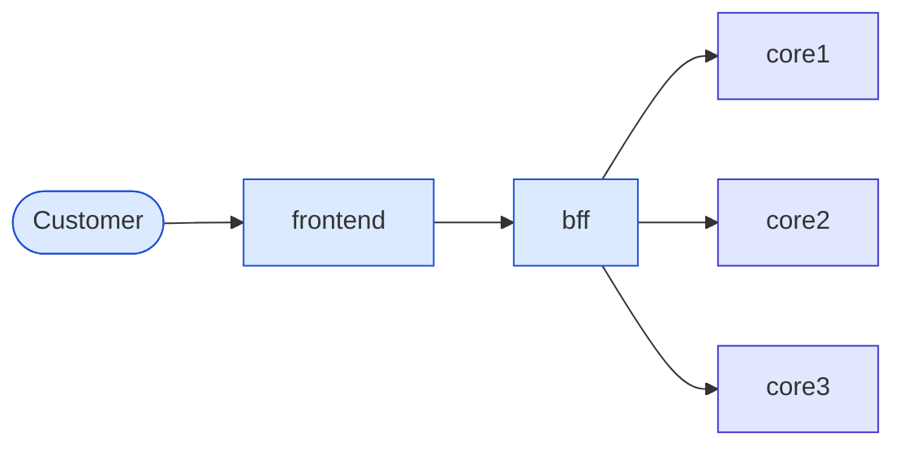

| Repo | Role |
| --- | --- |
| **frontend** | What the user sees. Calls only the BFF. React micro-app assembled with a shell (shell versioned in a separate repo). |
| **bff** | Backend for frontend. The only caller of the cores. |
| **core1, core2, core3** | Core services consumed by the BFF (DB, storage, …). |

Each repo uses **Option A** from [RELEASE_VERSIONING.md](./RELEASE_VERSIONING.md): `main`, `release/X.Y` while that component line is supported, tags `vX.Y.Z`, fix on `main`, cherry-pick onto the release branch.

This document adds what Option A does not cover:

1. **Customer tickets** — a customer (support) board that projects status from engineering work.
2. **The bundle** — the product version that pins one tag from each repo; the only version customers understand.

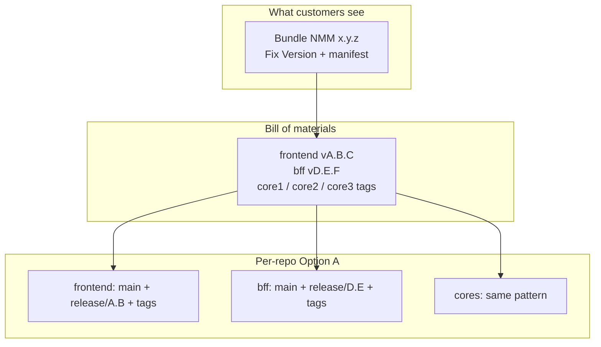

---

## 3. Two version clocks

A component version and a bundle version are different clocks. Do not collapse them into one number.

| | Component version | Bundle version |
| --- | --- | --- |
| Example | `frontend 2.3.1`, `bff 4.1.0`, `core2 3.0.1` | `NMM 1.4.0`, `NMM 1.4.1` |
| Where it lives | Git tag in that repo | Bundle manifest + Jira Fix Version |
| Who sees it | Engineers | Customers, support, the customer Jira board |
| Branch | `release/2.3` in the frontend repo | No Git branch. A manifest that points at five tags |
| When it bumps | That repo changed | The set of tags we ship changed |

`NMM 1.4.0` might pin `frontend 2.3.0`, `bff 4.1.0`, `core1 1.8.0`, `core2 3.0.1`, `core3 0.9.4`. The next patch bundle, `NMM 1.4.1`, might bump only `core1` and `bff` and repeat the other three tags unchanged.

Customers never need a core version. Support answers “which NMM are you on?” Engineers answer “which tag of core1 is inside that NMM?”

### 3.1 Manifest

The bundle is a bill of materials, not a sixth codebase. Tag it the same way you tag a component: an immutable name for one exact set.

```yaml
bundle: 1.4.1
components:
  frontend: v2.3.0
  bff: v4.1.2
  core1: v1.8.1
  core2: v3.0.1
  core3: v0.9.4
```

Keep the manifest in a thin release record (a small repo, or the body of a GitHub Release named `nmm-v1.4.1`). That record is the source of truth for “what we shipped as NMM 1.4.1.” Jira Fix Version `NMM 1.4.1` is the same name, used so tickets can be released in bulk.

Do not create `release/1.4` in every repo just because the bundle is 1.4. Each repo’s release branch follows **that repo’s** SemVer (`frontend` stays on `release/2.3`). The manifest is the join.

---

## 4. Quarterly release train

Inspired by [VS Code’s release train](https://code.visualstudio.com/api/advanced-topics/release-process) (monthly endgame → stable), stretched to a **quarter**. Feature bundles (`NMM 1.5.0`) ship on a quarterly cadence. Patch bundles (`NMM 1.4.1`, `1.4.2`, …) ship as needed *inside* the quarter on the current (and previous) supported line.

### 4.1 Phases and gates

| Phase | Rough share of quarter | Purpose | Exit gate |
| --- | --- | --- | --- |
| **Plan** | Week 1–2 | Technical debt, security, capacity, backlog for the quarter (features, internal bugs, customer-driven work) | Fix Version `NMM x.y.0` created; stories/tasks scoped and assigned |
| **Build** | Bulk of the quarter | Feature development on each repo’s `main` | Feature-complete decision; candidate set known |
| **Cut** | 1–2 days | Create `release/X.Y` only in repos that ship a **new** tag | Release branches exist; `main` is free for the *next* bundle |
| **Stabilize** | Final 2–3 weeks | QA + engineering; cherry-pick fixes onto release branches | Sign-off on candidate tags |
| **Ship** | Release day | Tag, publish manifest, Jira Released, notes | Bundle available; customer tickets with that Fix Version → Resolved |
| **Deliver** | After Ship | Implementation installs / coordinates upgrade | Operational; does not block Resolved |

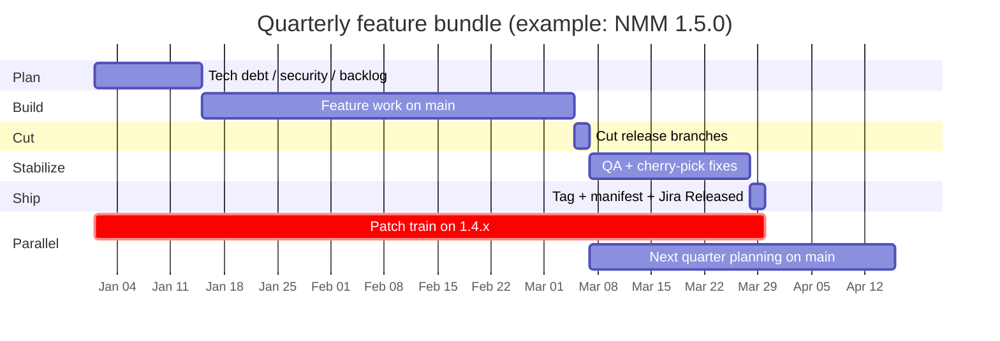

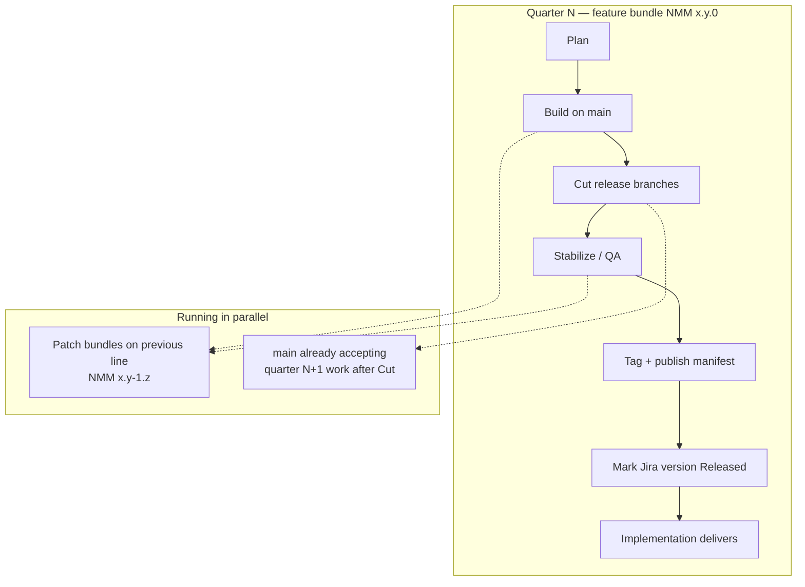

### 4.2 Who owns each phase

| Phase | Primary owner | Others |
| --- | --- | --- |
| Plan | Product + tech leads | Support (customer themes), Security |
| Build | Engineering | PO accepts stories into sprints |
| Cut | Release owner | Repo maintainers create branches |
| Stabilize | QA (leads); developers participate | Full team when severity warrants |
| Ship | Release owner | PO for notes; Support for customer comms |
| Deliver | Implementation | Support for verification follow-up (S1/S2) |

### 4.3 Stabilize in practice

- QA runs against the **candidate set**: new release branches + unchanged tags from the previous manifest.
- Bugs found in Stabilize: fix on that repo’s `main` first, then cherry-pick onto the release branch this bundle will tag. Open the cherry-pick as a PR.
- Do not merge the release branch back to `main`.
- Release-only commits (version bump, changelog) stay on the release branch.

### 4.4 Patch trains inside the quarter

| Bundle type | Cadence | Example | Contains |
| --- | --- | --- | --- |
| Feature | Once per quarter | `NMM 1.5.0` | Planned stories + fixes that landed before cut |
| Patch | As needed | `NMM 1.4.1`, `1.4.2` | Customer/security fixes on the supported line |
| Out-of-band | S1 (and some S2) | `NMM 1.4.1` early | Mitigate first, then a dedicated patch bundle |

---

## 5. Feature bundle lifecycle

`NMM 1.4.0` is a feature bundle. `NMM 1.5.0` can already be in development on every repo’s `main` while 1.4 is freezing. Same rule as Option A, one level up.

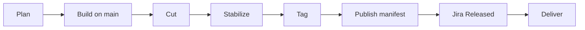

### 5.1 Plan

- The user story describes the outcome.
- Add a **task per repo** that must change. No task for a repo that stays on its current tag.
- Set Fix Version `NMM 1.4.0` on the story and on each task.
- A breaking change is a planning fact, not a surprise at tag time:
  - Breaking **core** API → the BFF task is in the same story and the same bundle.
  - Breaking **BFF** API → the frontend task is in the same story and the same bundle.
  - Additive change → only the repos that actually change.

### 5.2 Build

Each task is a normal pull request into that repo’s `main`. Feature work does not go onto a release branch. `main` of each repo is the next unreleased work, which may already be the *next* bundle if 1.4 has been cut.

The story stays In progress until every child task has merged.

### 5.3 Cut

When 1.4 is feature-complete, cut a release branch only in repos that will ship a **new** tag in this bundle:

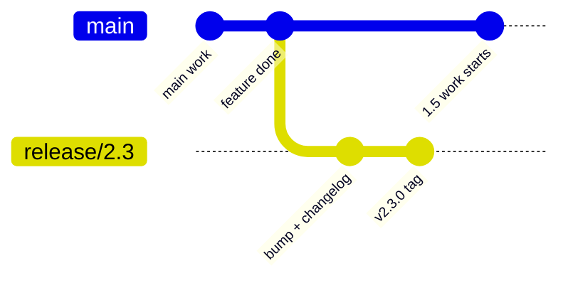

```
frontend main ──cut──► release/2.3     tag later: v2.3.0
bff main      ──cut──► release/4.1     tag later: v4.1.0
core1         (unchanged — bundle keeps the previous tag, no cut)
```

After the cut, `main` is 1.5 work. Version bump and changelog for the component stay on that repo’s release branch (release-only commits, not cherry-picked back to `main`).

A repo with no change since the previous bundle does not get a branch, a bump, or a new tag. The new manifest repeats the old tag.

### 5.4 Stabilize → Tag → Publish

1. Tag each repo that changed (`v2.3.0`, `v4.1.0`, …) and publish the GitHub Release.
2. Write the manifest with those tags and the repeated unchanged tags. Publish it as `nmm-v1.4.0`.
3. Generate bundle release notes via Jira **Release notes** → Create in Confluence (Stories/Bugs + **Release note** field); review and publish. See [JIRA_BUNDLE_DELIVERY.md](./JIRA_BUNDLE_DELIVERY.md) §5.
4. Mark Jira version `NMM 1.4.0` Released.
5. Stories and tasks in that version move to Done. Customer tickets in that version move to Resolved; their verification window opens.
6. Implementation delivers the released bundle and coordinates installation. Delivery does not move the ticket back from Resolved.

### 5.5 What each repo is doing during one bundle

| Moment | Repo that changes in this bundle | Repo that does not |
| --- | --- | --- |
| Build | PRs to `main` | Untouched |
| Cut | `release/X.Y` from `main` | No branch |
| Stabilize | Cherry-picks onto `release/X.Y` | Untouched |
| Ship | New tag, listed in the manifest | Previous tag listed again |
| After ship | Branch stays while that component line is inside a supported bundle | Nothing to delete |

---

## 6. Customer bug → patch bundle

A customer bug is a patch bundle on the line they are running, unless triage says otherwise.

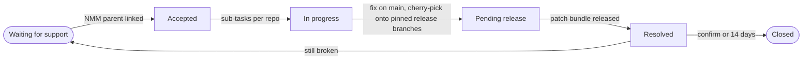

### 6.1 Which branches get the fix

Found in `NMM 1.4.0` means: look at **that manifest**, and patch the component release branches it pins — not “whatever `main` is,” and not a branch named `release/1.4` in every repo.

Example. Manifest for `NMM 1.4.0`:

```yaml
frontend: v2.3.0    # branch release/2.3
bff:      v4.1.0    # branch release/4.1
core1:    v1.8.0    # branch release/1.8
core2:    v3.0.1
core3:    v0.9.4
```

Bug in core1 + BFF; frontend / core2 / core3 unchanged:

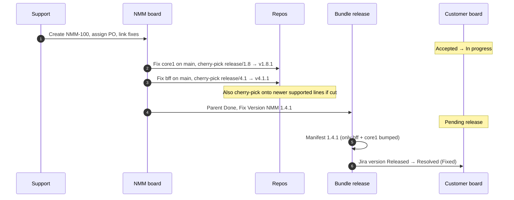

Publish:

```yaml
bundle: 1.4.1
components:
  frontend: v2.3.0   # unchanged
  bff: v4.1.1        # patched
  core1: v1.8.1      # patched
  core2: v3.0.1      # unchanged
  core3: v0.9.4      # unchanged
```

If the same fix must also ship as `NMM 1.5.1` because 1.5.0 already went out without it, that is a second Fix Version, produced by the cherry-pick onto the 1.5 component branches. One code fix, one bundle entry per line you still support.

### 6.2 Support window

Apply the window to **bundles**, not to every component minor independently.

| Line | Patches |
| --- | --- |
| Current bundle minor (`1.5.x` while 1.5 is current) | Fixes |
| Previous bundle minor (`1.4.x`) | Security and critical bugs |
| Older | No patch. Customer ticket resolves as upgrade. |

A component release branch is deleted when no supported bundle still pins a tag on that line. Tags stay. Same delete rule as Option A; the manifest shows whether the line is still in use.

---

## 7. Jira model

Two boards. One direction of status.

| Board | Who uses it | What is filed there |
| --- | --- | --- |
| **NMM** | This team | User stories, tasks, engineering bugs |
| **Customer** | The customer (and support) | Customer bugs |

Engineering does not implement on the customer board. The customer does not move NMM tickets. An NMM ticket **fixes** a customer ticket. Status on the customer ticket is a projection of that link, written by Jira Automation (or, until automation exists, by the person who transitions the NMM parent).

### 7.1 NMM board

| Issue type | Means | Done when |
| --- | --- | --- |
| **User story** | A product outcome. Usually a frontend feature. | Every child task is in the component tags pinned by a **released** bundle |
| **Task** | Work in one repo, linked to the story | The change is on that repo’s `main` and, once the bundle has been cut, on the release branch the bundle will tag |
| **Bug** | An engineering defect, including the parent opened for a customer bug | Same as a task, across every repo the bug actually touches |

A story that only changes the frontend still gets a frontend task. The story is the outcome; the task is the repo. Repos that do not change get no task.

The story does not close when the frontend PR merges. It closes when every child task has landed on the tag the bundle pins, and that bundle version is released in Jira.

Every story, task, and engineering bug that belongs in a train carries Fix Version = the bundle (`NMM 1.4.0`, `NMM 1.4.1`, …). Component versions stay in Git. They are not a second Jira version list.

Release notes do not read tasks. They read the story or the parent bug.

### 7.2 Customer board — required fields

| Field | Required | Use |
| --- | --- | --- |
| **Found in** | Yes | The bundle the customer is running (`NMM 1.4.0`). Chooses which component release branches are eligible for a backport. |
| **Severity** | Yes, at triage | S1–S4. Decides response targets and whether the fix waits for the next patch bundle. |
| **Link** | Yes, once accepted | One NMM bug that **fixes** this customer bug |
| **Fix Version** | Once the target bundle is known | The bundle that will contain the fix (`NMM 1.4.1`) |
| **Status** | Always | The workflow below |
| **Resolution** | Required on Resolved | Why the ticket closed |

One customer bug → **one** NMM parent. If the fix spans core1 and the BFF, those are sub-tasks of that parent, not peer tickets on the customer issue.

### 7.3 Severity

| Severity | Meaning | First response | Fix route |
| --- | --- | --- | --- |
| **S1** | Production down or data loss, no workaround | 1 hour | Mitigate first, then an out-of-band patch bundle |
| **S2** | Major function broken, workaround is painful | 4 business hours | Next patch bundle, or out-of-band if the customer cannot wait |
| **S3** | Function wrong, workaround exists | 1 business day | Next patch bundle |
| **S4** | Cosmetic, or a question | 2 business days | Backlog. Often the next feature bundle rather than a patch. |

Put the agreed times in the customer contract and keep this table in sync. Severity changes when the customer’s situation changes (e.g. workaround turns S1 → S2/S3). Record every change in a public comment.

### 7.4 Customer workflow

Main path: **Waiting for support → Accepted → In progress → Pending release → Resolved → Closed.** The NMM parent drives it up to Resolved. The customer’s verification ends it.

Side statuses: **Waiting for customer** and **Workaround provided.** Support sets them by hand. They describe the conversation, not the code.

| Phase | Statuses | Who has the ball |
| --- | --- | --- |
| **Triage** | Waiting for support | Support |
| **Fix** | Accepted, In progress, Workaround provided | Engineering |
| **Delivery** | Pending release | Release (patch bundle schedule) |
| **Verification** | Resolved → Closed | Customer |

Waiting for customer can interrupt triage or fix.

#### Status flow

Colour: blue = us, orange = customer, green = release, grey = finished.

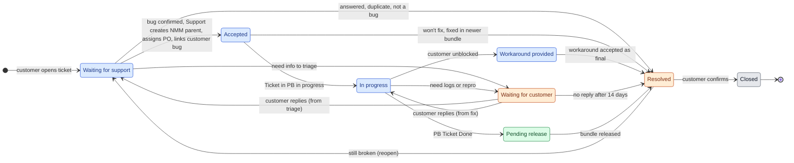

Resolved is orange: the ticket is back with the customer, to confirm or reopen.

#### Who does what, end to end

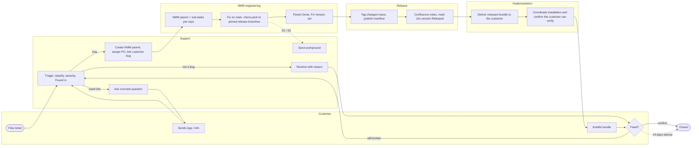

#### Happy path, with verification

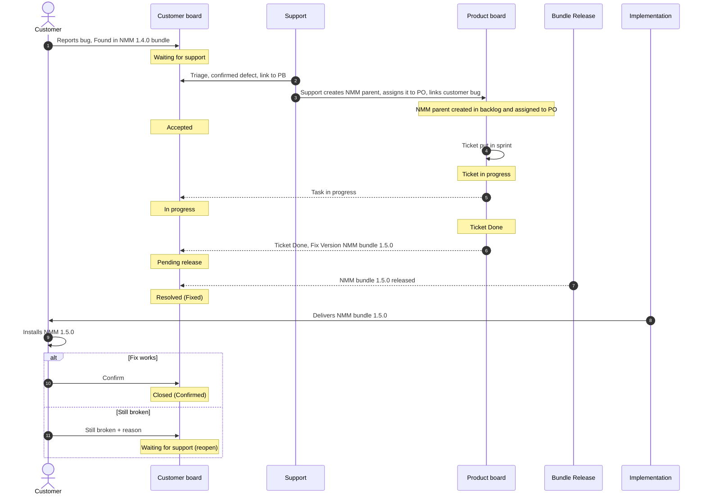

| Status | Meaning for the customer | Entry condition | Set by |
| --- | --- | --- | --- |
| **Waiting for support** | We received it; it is with us. | Filed, replied from Waiting for customer before triage finished, or reopened with Still broken | Customer, automation |
| **Accepted** | Confirmed defect, and we own it. | Triage confirmed bug, set severity, support created/assigned/linked one NMM parent with **fixes** | Support + automation |
| **In progress** | Engineering is working on it. | Any NMM sub-task is in progress | Automation from the NMM parent |
| **Workaround provided** | You are unblocked. The permanent fix is still coming. | Workaround sent and customer confirmed it works | Support, by hand |
| **Waiting for customer** | We need something from you. | Concrete ask: logs, repro, bundle version, access | Support, by hand |
| **Pending release** | Fixed, and scheduled for a named bundle. | Every required repo change merged on the release line; NMM parent Done; Fix Version set | Automation from the NMM parent |
| **Resolved** | We consider this done. Please verify. | Bundle released, or triage decided no code change | Automation (release) or support |
| **Closed** | Final. | Customer confirmed, or 14 days in Resolved without a reply | Customer, automation |

Do not copy internal states onto the customer ticket (in review, cherry-pick, waiting on core2). Those stay on the NMM sub-tasks.

#### Waiting for customer

Shows who has the ball. Without it, a ticket waiting for logs looks like engineering is slow.

- **Enter only with a concrete ask.** Public comment states exactly what is needed. “Please provide more info” does not qualify.
- **The clocks pause.** Time here does not count against first response, restore, or fix targets.
- **Return is automatic.** When the customer comments, automation returns to the status stored in hidden **Previous status**.
- **Reminders, then resolve.** Remind after 3 and 7 business days. After 14, resolve with **No response**.
- **Flag the NMM side.** Parent or sub-task gets the Jira flag (or `blocked-customer-info`). NMM status itself does not change.
- **Allowed from Waiting for support and In progress only.** After Pending release, verification happens after Resolved.

#### Workaround provided

Separates “customer unblocked” from “defect fixed.” Critical for S1/S2.

- **Not terminal.** NMM parent stays open; when Done → Pending release as usual.
- **Re-evaluate severity.** Entering this status normally lowers S1 to S2 or S3.
- **Stops the restore clock** (see [Clocks](#78-clocks)).
- **Write the workaround down.** Public comment + NMM parent. Known issues for the bundle if it applies to others.
- **Can end the ticket.** If accepted as permanent → resolve **Workaround**; close NMM parent as Won’t fix.

### 7.5 Resolutions

| Resolution | When |
| --- | --- |
| **Fixed** | The bundle in Fix Version is released |
| **Fixed in newer bundle** | Already fixed in a bundle they do not run. Comment names the upgrade target. |
| **Workaround** | Workaround accepted as final, no code fix |
| **Answered** | A question or a configuration issue |
| **Won’t fix** | Outside the support window, or a product decision |
| **Duplicate** | Linked to the original customer ticket |
| **Cannot reproduce** | Tried with the information provided |
| **No response** | Waiting for customer timed out |

### 7.6 Verification

**Release resolves availability; Implementation delivers; the customer verifies.** Customer confirmation is not the gate for Resolved:

- Many customers never reply — waiting would leave tickets open for months.
- Released is not installed — a customer may take weeks to upgrade.
- Clocks need a stop we control — time to delivery ends at release.

So: **Resolved** = our statement (done, please verify). **Closed** = final (customer or timeout).

| Action | Ticket moves to | Also |
| --- | --- | --- |
| **Confirm** | Closed | Customer confirmation = Confirmed |
| **Still broken** | Waiting for support | Reason required. Confirmation = Reopened. Reopen count++ |

No action → stay Resolved; reminder day 7; **Closed** day 14 with Timed out. Window applies to every resolution.

**Handling Still broken:**

| Support finds | NMM side | Customer ticket |
| --- | --- | --- |
| Same defect, fix incomplete | Reopen NMM parent. New sub-tasks as needed. Fix Version = next patch. | Main path again |
| Different defect | New NMM bug linked **fixes**. Old parent stays Done. | Same ticket, new link |
| Fix works, install/config wrong | None | Resolved (Answered) |
| Customer has not installed | None | Resolved again with bundle id + install pointer |

**After Closed,** no reopen. New problem → new ticket, **relates to** the closed one.

**S1 and S2 get active verification.** Resolution comment asks explicitly to confirm after install; Support follows up on upgrade reports. Ticket is still Resolved on release so clocks stop the same way.

**What verification measures:**

- **Confirmation rate:** Confirmed ÷ (Confirmed + Timed out)
- **Reopen rate:** Resolved tickets that came back with Still broken (escaped fixes for Fixed)
- Optional: satisfaction survey on Closed (JSM built-in)

### 7.7 Clocks {#78-clocks}

| Clock | Starts | Paused in | Stops | Owner |
| --- | --- | --- | --- | --- |
| **First response** | Waiting for support | Waiting for customer | First public support comment, or Accepted | Support |
| **Time to restore** (S1, S2) | Waiting for support | Waiting for customer | Workaround provided or Pending release (whichever first) | Support + engineering |
| **Time to fix** | Accepted | Waiting for customer | Pending release | Engineering |
| **Time to delivery** | Pending release | — | Resolved | Release |

Fix and delivery are separate on purpose. A week in Pending release is the patch schedule, not an engineering delay.

No clock runs on us during verification. A reopen starts a new cycle of every clock; report reopened cycles separately.

### 7.8 Status sync

Engineering progress flows one way: NMM → customer, on **fixes**. Side statuses are the exception (Support, by hand).

| Transition | Driver |
| --- | --- |
| → Accepted, → In progress, → Pending release, → Resolved (Fixed) | Automation from NMM parent and from releasing the Jira version |
| → Waiting for customer, → Workaround provided, → Resolved (other) | Support, by hand, with a public comment |
| Waiting for customer → previous status | Automation, when the customer comments |
| Resolved → Closed (Confirm), Resolved → Waiting for support (Still broken) | Customer, on the portal |
| Resolved → Closed after 14 days | Automation |

| NMM parent moves to | Customer ticket becomes | Also |
| --- | --- | --- |
| Created, assigned, and linked | **Accepted** | Comment with the NMM key |
| In progress | **In progress** | — |
| Done, Fix Version not yet released | **Pending release** | Copy Fix Version onto the customer ticket |
| Fix Version released in Jira | **Resolved (Fixed)** | Comment: bundle id + which component tags changed |
| Won’t fix / Duplicate / Cannot reproduce | **Resolved** with that resolution | Comment with reason |

Guard rules:

1. Customer ticket in **Waiting for customer** ignores NMM parent transitions until the customer replies.
2. Customer ticket in **Workaround provided** ignores every NMM parent transition except Done.

“Code is on `main`” is not Resolved. Releasing the Jira version is the switch. Implementation delivery does not delay Resolved.

Until automation exists: the person who sets the NMM parent to Done sets Pending release + Fix Version; the person who publishes the bundle marks Released and resolves linked customer tickets.

### 7.9 Triage outcomes that still write back

| Outcome | Customer status | NMM work |
| --- | --- | --- |
| Will fix on their line | Accepted → normal path | Parent + sub-tasks, Fix Version = next patch on that line |
| Already fixed in a newer bundle | Resolved (Fixed in newer bundle) | Comment “upgrade to NMM x.y.z”. No new code. |
| Bundle outside support window | Resolved (Won’t fix) | Fix only on `main` and supported lines. Point at oldest supported bundle with the fix. |
| Question or configuration | Resolved (Answered) | None. Never Accepted. |
| Cannot reproduce / duplicate / by design | Resolved with that resolution | No release branch work |

### 7.10 Examples

**S1 outage, workaround first**

1. Login fails for every user on `NMM 1.4.0`. **Waiting for support**, S1. Clocks start.
2. Support confirms, creates `NMM-210`, assigns PO, links. **Accepted** → **In progress**.
3. Config flag disables failing SSO path; customer confirms. **Workaround provided.** Restore met. Severity → S2.
4. Fix in core2 + BFF, cherry-picked; `NMM-210` Done, Fix Version `NMM 1.4.1`. **Pending release.**
5. `NMM 1.4.1` released. **Resolved (Fixed).** Active verification ask.
6. Implementation delivers. Customer confirms. **Closed (Confirmed).**

**S3 bug, missing information**

1. Wrong total on a report. **Waiting for support**, S3.
2. Need bundle version + example ID. **Waiting for customer.** Clocks pause.
3. Customer replies → automation returns to **Waiting for support**.
4. Reproduced; `NMM-230` linked. **Accepted** → **In progress**.
5. Need logs. **Waiting for customer** again; NMM sub-task flagged.
6. No reply → day 14 **Resolved (No response).**
7. Later: Still broken + logs → **Waiting for support**, new clock cycle.

**S3 fix that did not work**

1. `NMM-240` / `NMM 1.4.2` released. **Resolved (Fixed).**
2. Still broken after install. Reopen count = 1.
3. Same defect, missed path. Parent reopened, Fix Version `NMM 1.4.3`. Main path again.
4. `NMM 1.4.3` released. 14 days silence → **Closed (Timed out).**

### 7.11 Jira setup for the customer workflow

- Workflow: keep **Waiting for support** / **Waiting for customer**. Add **Accepted**, **Workaround provided**, **Pending release** in “In progress”. **Resolved** / **Closed** in “Done”.
- Resolution required on → Resolved; clear on Still broken.
- Portal from Resolved: **Confirm** → Closed; **Still broken** → Waiting for support (comment required).
- Fields: hidden **Previous status**; **Customer confirmation** (Confirmed / Timed out / Reopened); **Reopen count**.
- Clocks: JSM SLA goals from [Clocks](#78-clocks); reopen starts a new cycle.
- Six automation rules:
  1. Customer comments while Waiting for customer → previous status.
  2. Waiting for customer reminders (days 3, 7) → Resolved (No response) day 14.
  3. NMM parent transition → customer status (two guard rules).
  4. Jira version Released → Resolved (Fixed) for that Fix Version.
  5. Resolved 7 days → reminder; 14 days → Closed (Timed out).
  6. Still broken → increment Reopen count, clear Resolution, notify support rotation.

---

## 8. Compatibility inside a bundle

The manifest is a known-good set. A tag does not enter a bundle unless every consumer **in that same manifest** can call it.

| Change | Ships in the same bundle as |
| --- | --- |
| Additive core API | Core only, if the current BFF tolerates it |
| Breaking core API | Updated BFF |
| Additive BFF API | BFF only, if the current frontend tolerates it |
| Breaking BFF API | Updated frontend |

Deploy order when services roll rather than install atomically:

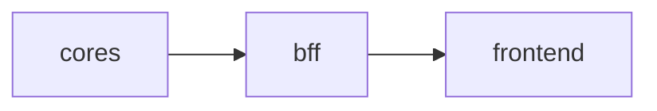

During a rolling deploy, two versions of a service can be alive briefly. Schema and API changes still follow expand → switch → contract from [RELEASE_VERSIONING.md](./RELEASE_VERSIONING.md). A patch bundle must not contain a contract step that the previous bundle’s binaries still need, unless you accept downtime.

Frontend speaks only to the BFF. Cores are not a second client API for the frontend.

---

## 9. Release notes

Two note streams. Different audiences; not copies of each other. Operational click path: [JIRA_BUNDLE_DELIVERY.md](./JIRA_BUNDLE_DELIVERY.md) §5.

| Note | Audience | Question | Where |
| --- | --- | --- | --- |
| **Bundle notes** | Customers, support, customer board | What changed in NMM since the previous bundle on this line? | Confluence page from Jira **Release notes** → Create in Confluence (linked under version Related work) |
| **API notes** | Customers who call the API | What changed in the API contract since the previous API tag? | GitHub Release on the API repo (BFF, if that is what they call) |
| **Other component notes** | This team | What landed in core1 `v1.8.1`? | GitHub Release on that repo. Not sent to the customer. |

### 9.1 “Since the previous release”

A release note is the set of issues whose Fix Version **is** this version — not a date range.

| This note | Previous release | Query |
| --- | --- | --- |
| Bundle `NMM 1.4.1` | `NMM 1.4.0` | `fixVersion = "NMM 1.4.1" AND type in (Story, Bug)` |
| Bundle `NMM 1.5.0` | `NMM 1.4.0` (feature line) | `fixVersion = "NMM 1.5.0" AND type in (Story, Bug)` |
| API `v4.1.2` | previous API tag on that line | GitHub Release / commits since previous tag |

Tasks and sub-tasks stay out of both queries.

### 9.2 Fields on stories and parent bugs

Do **not** reuse Description or Acceptance Criteria for the changelog. Those stay for engineering and QA.

| Field | Audience | Role |
| --- | --- | --- |
| **Description** | Devs | Context, design, links |
| **Acceptance criteria** | QA / Done | Testable checks |
| **Release note** | Customers / support | Changelog line for Confluence |

Before Done:

| Field | Required | Use |
| --- | --- | --- |
| **Release note** | Yes if customer-visible; empty = omit | One or two sentences in customer language. Paragraph field on Story and Bug (parent) only. |
| **API impact** | Yes if any child task is on the API repo | `None`, `Additive`, `Deprecated`, or `Breaking` |
| **API migration** | Yes when Deprecated or Breaking | What the caller must change, and by which API version the old behavior disappears |

### 9.3 Publish path (Jira → Confluence)

On Jira Cloud with Confluence on the same site:

1. Releases → open Fix Version → **Release notes** → **Create in Confluence**.
2. Work types: Story and Bug only.
3. Fields: **Release note** (and Key if useful). Do not select Description or Acceptance Criteria.
4. Review the **draft** page; reshape using the template below; publish. Related work links back to the version.

Alternative without Confluence: **Create release notes in Jira** (copy Markdown/HTML). Mark the version Released only after notes are reviewed.

### 9.4 Bundle note template

Publish the **Release note** field, not key+summary alone. Use this shape when editing the Confluence draft (and optionally mirror a short summary on the Jira version description).

```
## NMM 1.4.1

Changes since NMM 1.4.0.

### Features
- <Release note from each Story in this Fix Version>

### Fixes
- <Release note from each Bug in this Fix Version>
  Customer issues: <customer keys linked with "fixes">

### API
Since API v4.1.0 (this bundle pins v4.1.2).
- Additive — <API migration or release note>
- Breaking — <API migration>
Full API changelog: <link to the API GitHub Releases from v4.1.0 to the pinned tag>

### Included builds
frontend v2.3.0 (unchanged)
bff      v4.1.2
core1    v1.8.1
core2    v3.0.1 (unchanged)
core3    v0.9.4 (unchanged)
```

Omit empty headings. API section is the contract delta **between the two manifests**. If the BFF tag did not change: “API unchanged (`v4.1.0`)”.

Filter:

```
fixVersion = "NMM 1.4.1" AND type in (Story, Bug) AND "Release note" is not EMPTY
```

### 9.5 API note (component)

On the API repo only, every tag gets a GitHub Release grouped as Breaking / Deprecated / Additive / Fixes. Cores and frontend get team-facing GitHub Releases only — not copied into Jira or the customer Confluence page.

### 9.6 Who writes which line

| Change | Bundle note | API note |
| --- | --- | --- |
| Frontend feature, API unchanged | Features | No |
| Customer bug fixed in a core, contract unchanged | Fixes | No |
| New optional API field | Features or Fixes + API “Additive” | Additive |
| Removed or renamed API field | API “Breaking” + migration | Breaking |
| Internal refactor, no customer-visible change | Omit (empty Release note) | No |

---

## 10. Who moves what

| Event | Repo | NMM Jira | Customer Jira | Manifest | Implementation |
| --- | --- | --- | --- | --- | --- |
| Story started | PRs to `main` | Story + tasks In progress | — | — | — |
| Bundle cut | `release/X.Y` in repos that change | Fix Version already set | — | Draft | — |
| Freeze bug | `main`, then cherry-pick | Bug tasks | — | Draft updates tags | — |
| Customer bug accepted | — | Support creates parent, assigns PO, links **fixes** | Accepted | — | — |
| Customer fix merged on their line | Tags on repos that changed | Parent Done | Pending release + Fix Version | `NMM x.y.z` published | — |
| Version released | API GitHub Release if that tag is new | Confluence bundle notes published; stories Done | Resolved | Already published | Deliver + coordinate install |
| Customer confirms, or 14 days | — | — | Closed | — | Support verification follow-up when needed |
| Still broken | — | Parent reopened, or new linked bug | Waiting for support | — | Escalate failed install/verify to Support |

---

## 11. What not to do

- Do not resolve the customer ticket when the PR merges to `main`. Resolve when the installable bundle is released. Close on confirm or 14-day timeout.
- Do not wait for customer confirmation before resolving. Resolved is ours; Closed is theirs.
- Do not open one NMM ticket per repo as peers on the customer bug. One parent; sub-tasks per repo.
- Do not give every repo a `release/1.4` to match the bundle number. Component branches follow component versions; the manifest joins them.
- Do not bump and retag a repo that did not change. Repeat the previous tag.
- Do not merge a component’s release branch back into `main`. Cherry-pick product fixes; leave version bumps on the release branch.
- Do not put component SemVer into customer-visible status. Say `NMM 1.4.1`; put component tags in the resolution comment for engineers.
- Do not leave Accepted / In progress / Pending release as a manual courtesy — automate from the NMM parent and from releasing the Jira version.
- Do not publish Description, Acceptance Criteria, or key+summary alone as the changelog. Publish the **Release note** field via Release notes → Confluence.
- Do not build the note from a date range. Use `fixVersion = this version`.
- Do not give cores or the frontend a customer-facing changelog. Only the API the customer calls gets component notes.
- Do not create Jira versions per component.

---

## 12. Minimum setup

1. Jira versions on both boards, same names: `NMM 1.4.0`, `NMM 1.4.1`, …
2. Link type **fixes** from the NMM bug to the customer bug.
3. Required **Found in** and **Severity** on customer bugs; required **Resolution** on Resolved.
4. Customer workflow Waiting for support → Closed, with Waiting for customer, Workaround provided, Confirm / Still broken, and SLA clocks.
5. The six automation rules from [§7.11](#711-jira-setup-for-the-customer-workflow).
6. A manifest published with every bundle, listing five tags (new or repeated).
7. Support window written next to the bundle line (current minor, previous minor, then upgrade).
8. Fields on stories and parent bugs: **Release note**, **API impact**, **API migration** (Release note on Story/Bug only — not Description/AC).
9. Bundle notes via Jira **Release notes** → Create in Confluence before Released; API changelog on the API repo’s GitHub Release for each new tag. Details: [JIRA_BUNDLE_DELIVERY.md](./JIRA_BUNDLE_DELIVERY.md) §5.
10. An Implementation delivery path per supported customer: owner, handoff, install coordination, escalation to Support when verification fails.
11. Named **Release owner** and published quarterly calendar (Plan / Cut / Stabilize / Ship dates).

Component git policy stays Option A in each repo. The bundle is the product. The customer ticket tracks the bundle, not the pull request.
