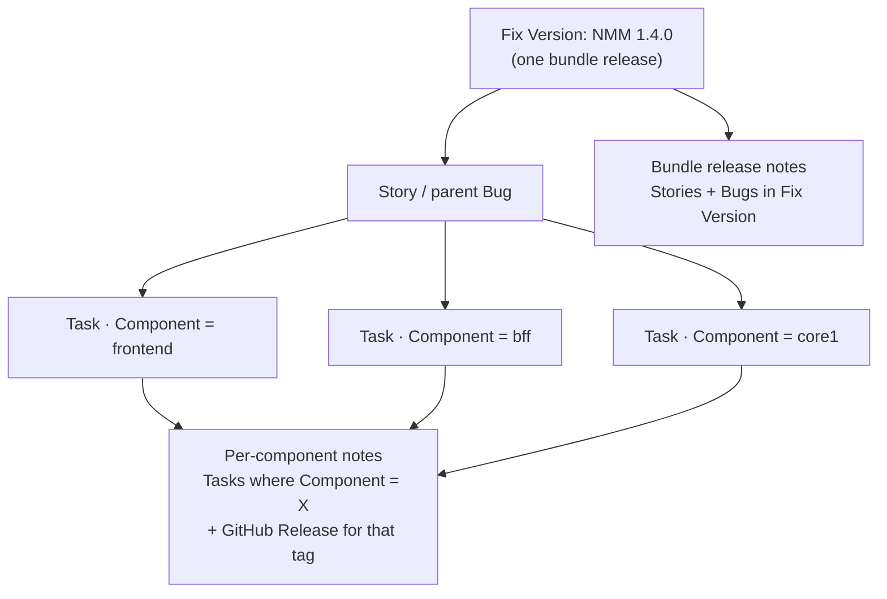
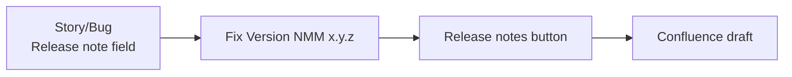

# Jira → bundle delivery playbook

How to plan, track, and ship an NMM bundle in Jira — from backlog through release notes — with as much automation as possible.

**Related:** [DEVELOPMENT_LIFECYCLE.md](./DEVELOPMENT_LIFECYCLE.md) (model and phases) · [RELEASE_VERSIONING.md](./RELEASE_VERSIONING.md) (per-repo Git).

This document is the **operational checklist**. The lifecycle doc explains *why*; this one lists *what to set up* and *what to run each train*.

---

## 1. Goals

| Goal | How we achieve it |
| --- | --- |
| One customer-facing version | Jira Fix Version = bundle (`NMM 1.4.0`). Already in place. |
| See what changed **per component** | Jira **Component** on every task + one task per repo that changes. No second Fix Version list. |
| Automated release notes | Required **Release note** field on stories/bugs → Jira **Release notes** button creates a Confluence draft (primary). |
| User documentation | Developers write in the MD docs app; story Done includes a docs checklist, not a Jira wiki dump. |
| Professional delivery | Gates below (Plan → Build → Cut → Stabilize → Ship → Deliver) with owners and exit criteria. |

---

## 2. Answer first: can we separate “what shipped per component”?

**Yes — without creating Jira versions per component.**

Fix Version stays the **bundle**. Component identity lives on **tasks** (and optionally on bugs). Consumers of a single repo (another team, or a customer calling only the API) read that **component’s** view, not a second release train in Jira.



| Audience | What they need | Source |
| --- | --- | --- |
| Customer / support | What changed in the product | Confluence release page from Stories/Bugs **Release note** field in Fix Version |
| Team that consumes **core2** | What landed in `core2 v3.0.2` | Tasks with Component = `core2` in this Fix Version **plus** GitHub Release on the core2 repo |
| Customer who calls the **API** | Contract delta | API GitHub Release for the BFF tag pinned in the manifest (not every core changelog) |
| Release owner | Which repos actually bumped | Manifest delta vs previous bundle |

**Do not** create Jira versions named `frontend 2.3.0` or `bff 4.1.0`. Those versions live in Git tags. Jira’s job is the bundle + the Component label on work items.

---

## 3. Jira setup (do once)

### 3.1 Versions

| Board | Versions | Rule |
| --- | --- | --- |
| NMM | `NMM x.y.z` | Create at Plan; mark Released on Ship |
| Customer | Same names | Keep in sync (automation or release owner) |

You already link stories via Fix Version — keep that as the single release bucket.

### 3.2 Components (required for per-component views)

Create Jira **Components** matching the repos:

| Component | Means |
| --- | --- |
| `frontend` | UI micro-app |
| `bff` | Backend-for-frontend / customer-facing API |
| `core1` | Core service 1 |
| `core2` | Core service 2 |
| `core3` | Core service 3 |
| `docs` | Optional — user-doc work in the MD app (if tracked in Jira) |
| `release` | Optional — manifest / release-record chores |

**Rule:** every **Task** has exactly one Component (the repo). Stories do **not** need a Component (they span repos). Parent bugs may leave Component empty; their sub-tasks carry it.

### 3.3 Custom fields on Story and Bug (parent)

Do **not** put customer changelog text in Description or Acceptance Criteria. Those stay for engineering and QA.

| Field | Audience | Role |
| --- | --- | --- |
| **Description** | Devs | Context, design, links |
| **Acceptance criteria** | QA / Done | Testable checks |
| **Release note** | Customers / support | 1–2 sentences in plain language for the changelog |

| Field | Required when | Purpose |
| --- | --- | --- |
| **Release note** | Customer-visible change | Paragraph / multi-line text on Story and Bug (parent) only — **not** on Tasks. Empty = omit from notes. |
| **API impact** | Any child touches `bff` (or the public API repo) | `None` / `Additive` / `Deprecated` / `Breaking` |
| **API migration** | Deprecated or Breaking | What callers must change |
| **Docs link** | User-visible feature or behavior change | URL to the page in the MD docs app (draft or published) |
| **Docs status** | Same | `Not needed` / `Draft` / `Ready` |

Create **Release note** in Jira admin as a Paragraph (multi-line) field; add it to Story and Bug screens only.

### 3.4 Issue hierarchy (NMM board)

| Type | Use | Fix Version | Component |
| --- | --- | --- | --- |
| **Story** | Product outcome | Bundle | Empty |
| **Task** | One repo’s work under a story | Same bundle | **Required** — that repo |
| **Bug** (parent) | Engineering / customer-driven defect | Bundle when known | Empty |
| **Sub-task** | One repo under a bug | Same bundle | **Required** — that repo |

Release notes and customer-facing summaries read **Story** and **Bug** only. Tasks feed the **per-component** report and engineering GitHub Releases.

### 3.5 Saved filters (create once, reuse every release)

```
# Bundle release notes (customer)
project = NMM AND fixVersion = "NMM 1.4.0" AND type in (Story, Bug) AND "Release note" is not EMPTY

# Work in this bundle for one component (example: bff)
project = NMM AND fixVersion = "NMM 1.4.0" AND component = bff AND type in (Task, Sub-task)

# Stories missing a release note before Ship
project = NMM AND fixVersion = "NMM 1.4.0" AND type in (Story, Bug) AND status = Done AND "Release note" is EMPTY AND "Docs status" != "Not needed"

# Docs gate
project = NMM AND fixVersion = "NMM 1.4.0" AND type = Story AND "Docs status" = Draft
```

Replace the version string each train (or use `fixVersion = earliestUnreleasedVersion()` / a script that injects the version).

### 3.6 Automation to enable (priority order)

| # | Trigger | Action | Priority |
| --- | --- | --- | --- |
| 1 | Story/Bug → Done | Validate: Release note filled **or** labelled `internal-only`; Docs status ≠ Draft | High |
| 2 | Version marked Released | Resolve linked customer tickets (see lifecycle §7.11) | High |
| 3 | Before marking Released | Release owner runs **Release notes** → Create in Confluence (select Story/Bug + Release note field) | High |
| 4 | Task created under Story | Copy Fix Version from parent; require Component | Medium |
| 5 | PR linked / merged (GitHub for Jira) | Transition task; optional comment with component tag | Medium |
| 6 | Bundle Released | Comment on customer ticket: bundle id + which component tags changed (from manifest) | Medium |

Until notes are published, do not mark the version Released. Confluence is the primary artifact; optional later automation can also copy a summary into the Jira version description.

---

## 4. End-to-end checklist (every bundle)

### Phase A — Plan

| # | Action | Owner | Done when |
| --- | --- | --- | --- |
| A1 | Create Fix Version `NMM x.y.z` on NMM (+ customer board) | Release owner / PO | Version exists, start date set |
| A2 | Scope stories into that Fix Version | PO | Stories listed under the version |
| A3 | Under each story: **one Task per repo that will change**; set Component | Dev lead | No orphan story without repo tasks |
| A4 | Set API impact early if BFF/core contracts change | Tech lead | Breaking changes paired across repos in the **same** bundle |
| A5 | Flag stories that need user docs (`Docs status` = Draft) | PO | Docs backlog visible |
| A6 | Publish train calendar (Cut / Stabilize / Ship dates) | Release owner | Team knows the freeze |

### Phase B — Build

| # | Action | Owner | Done when |
| --- | --- | --- | --- |
| B1 | Implement on each repo’s `main` (Option A) | Devs | PRs merged |
| B2 | Keep Fix Version + Component correct on every task | Devs | Filters stay accurate |
| B3 | Write **Release note** on the story when the outcome is clear | Dev / PO | Field filled or `internal-only` |
| B4 | Draft user docs in the MD app; paste **Docs link** | Dev | Draft URL on the story |
| B5 | Story stays In progress until **all** child tasks merged | PO | Hierarchy honest |

### Phase C — Cut

| # | Action | Owner | Done when |
| --- | --- | --- | --- |
| C1 | Decide feature-complete set | PO + release owner | Candidate stories frozen |
| C2 | Cut `release/X.Y` only in repos that get a **new** tag | Repo maintainers | Branches exist |
| C3 | Repos with no change: no branch, no bump | Maintainers | Manifest will repeat previous tags |

### Phase D — Stabilize

| # | Action | Owner | Done when |
| --- | --- | --- | --- |
| D1 | QA against candidate tags + repeated tags | QA | Sign-off or known bugs filed |
| D2 | Fixes: `main` first, then cherry-pick to release branch | Devs | PRs on release lines |
| D3 | Update Release note / Docs if behavior changed in freeze | Dev / PO | Notes still true |

### Phase E — Ship (professional delivery gate)

| # | Action | Owner | Done when | Automate? |
| --- | --- | --- | --- | --- |
| E1 | Tag each changed repo; publish GitHub Release (component notes) | Maintainers | Tags exist | CI on tag |
| E2 | Publish **manifest** (`nmm-vX.Y.Z` with five pins) | Release owner | Manifest immutable | Script from tags |
| E3 | **Release notes** → Create in Confluence (Story/Bug + **Release note** field); review draft; publish | Release owner | Confluence page linked under Related work | Jira native |
| E4 | Edit Confluence draft: group Features/Fixes, add API + Included builds + Docs links (checklist §5.3) | Release owner | Page matches template | Manual edit |
| E5 | Docs status = Ready for user-visible stories; publish MD app pages | Devs / PO | Docs live or linked as “new in NMM x.y” | Checklist gate |
| E6 | Empty Release note + internal-only labelled, or field filled | PO | Notes filter clean | Automation validator |
| E7 | Mark Jira version **Released** (both boards) | Release owner | Version Released | Manual click; rest automatic |
| E8 | Stories/tasks → Done; customer tickets → Resolved | Automation | Boards match | Yes |

### Phase F — Deliver

| # | Action | Owner | Done when |
| --- | --- | --- | --- |
| F1 | Implementation installs / coordinates upgrade | Implementation | Bundle available to customer |
| F2 | Support follows verification (S1/S2) | Support | Closed or reopen path |
| F3 | Delivery does **not** block Resolved | — | Per lifecycle |

---

## 5. Release notes (custom field → Confluence)

### 5.1 Design

Primary publish path: fill **Release note** on each Story/Bug → use Jira’s **Release notes** button → **Create in Confluence**. Requires Confluence on the same Atlassian site.



| Layer | Input | Output |
| --- | --- | --- |
| **Bundle notes** | Stories + Bugs in Fix Version with non-empty **Release note** | Confluence page (draft → publish), linked under the version’s **Related work** |
| **API notes** | Commits / changelog on BFF between previous and new pinned tags | GitHub Release on BFF (customer-callable API) |
| **Component notes** | Tasks/Sub-tasks with Component = X in this Fix Version; plus git log since previous tag | GitHub Release on that repo; optional internal digest — **not** a second Confluence release train |
| **User docs** | MD app pages linked from **Docs link** | Written by humans; link from the Confluence page if useful |

Key + summary alone are not customer-ready. Always source changelog lines from the **Release note** field. Never select Description or Acceptance Criteria when generating notes.

### 5.2 Jira → Confluence click path (every Ship)

Works on **Jira Cloud** when Confluence is on the same site. Marking a version Released does **not** create the page by itself — you open **Release notes** and choose the destination.

1. Project → **Releases** → open Fix Version `NMM x.y.z`.
2. Click **Release notes**.
3. Choose **Create in Confluence** (preferred).
4. Pick the Confluence space / parent page.
5. **Work types:** Story and Bug only — exclude Task and Sub-task.
6. **Fields:** **Release note** (and Key if you want issue links). Optionally **API impact** / **API migration** / **Docs link** for internal audiences. Do **not** include Description or Acceptance Criteria.
7. **Create in Confluence** → opens a **draft** page; Related work on the version gets a link.
8. Review and edit the draft using the checklist in §5.3, then publish.

Alternative (no Confluence, or for pasting elsewhere): **Create release notes in Jira** → copy Markdown/HTML, or save under Related work. Same field selection rules.

### 5.3 Bundle note shape (Confluence review checklist)

Jira’s generated table is a starting point. Before publishing the draft, reshape (or append) so the page reads like this:

```markdown
## NMM 1.4.1

Changes since NMM 1.4.0.

### Features
- <Release note from each Story>

### Fixes
- <Release note from each Bug>
  Customer issues: <keys linked with "fixes">

### API
Since API <previous BFF tag> (this bundle pins <new BFF tag>).
- Additive / Deprecated / Breaking — from API impact + API migration fields
Full API changelog: <link to BFF GitHub Releases>

### Included builds
frontend  v2.3.0 (unchanged)
bff       v4.1.2
core1     v1.8.1
core2     v3.0.1 (unchanged)
core3     v0.9.4 (unchanged)

### User documentation
- <Docs link from each Story where Docs status = Ready>
```

Omit empty sections. Mark the Jira version Released only after the Confluence page is reviewed (and published, or clearly ready to publish).

### 5.4 Per-component digest (what other teams / API consumers need)

The Confluence page stays **bundle**-level. Per-component separation is still Fix Version + Component on tasks — not a second Jira version or a second Confluence “release” per repo.

```markdown
## core1 — changes in NMM 1.4.1 (tag v1.8.1, was v1.8.0)

Engineering work in this bundle:
- NMM-210 / TASK: <summary>  (parent story/bug: NMM-200)
- NMM-211 / TASK: …

GitHub Release: https://github.com/org/core1/releases/tag/v1.8.1
```

**Consumers:**

| Consumer | Point them at |
| --- | --- |
| Internal team depending on core1 | Component filter + core1 GitHub Release |
| Customer calling HTTP API | Bundle **API** section + BFF GitHub Release only |
| Customer using the product UI | Confluence Features/Fixes + MD docs links |

Cores and frontend do **not** get a second customer-facing changelog in Jira or Confluence.

### 5.5 Optional later automation

Native Jira → Confluence is enough for the first trains. Add a script only if you need GitHub Release bodies, Slack digests, or fully unattended assembly:

1. Inputs: `BUNDLE=NMM 1.4.1`, previous bundle id, path to new manifest YAML.
2. Jira REST / JQL for Stories/Bugs with Release note; tasks by Component; Docs links where Ready.
3. Diff manifests → unchanged vs bumped tags.
4. Write Markdown next to the manifest / attach to `nmm-v1.4.1`; optionally patch the Jira version description.
5. Exit non-zero if Done stories lack Release note and are not `internal-only`.

### 5.6 Component GitHub Releases (per repo, on tag)

On each component tag CI:

- Title: `vX.Y.Z`
- Body: conventional commits / changelog since previous tag on that line
- For **BFF**: group Breaking / Deprecated / Additive / Fixes (customer-callable contract)
- For **cores / frontend**: engineering-facing; link parent Jira keys from commit messages (`NMM-123`)

This is the durable record for “what did this component do?” when another team only cares about one repo.

---
## 6. User documentation (MD app)

Release notes answer “what changed.” The MD app answers “how do I use it.”

| Rule | Detail |
| --- | --- |
| Writers | Developers (and PO review for customer tone) |
| Tool | Your MD documentation app — not Jira description fields |
| Gate | Story cannot Ship as customer-visible if Docs status is Draft |
| Linkage | **Docs link** on the story; listed under “User documentation” on the Confluence release page |
| Timing | Draft during Build; publish on or before Ship |
| Skip | Pure internal / no UI or behavior change → Docs status = Not needed |

Do not auto-generate user docs from the Release note field. Short release blurbs and full how-to pages have different quality bars.

---

## 7. Queries cheat sheet (per-component separation)

Given Fix Version `NMM 1.4.0` already linking stories:

| Question | Query / source |
| --- | --- |
| What is in this bundle for customers? | Confluence release page for the version, built from `fixVersion = "NMM 1.4.0" AND type in (Story, Bug) AND "Release note" is not EMPTY` |
| What did we do in **bff**? | `fixVersion = "NMM 1.4.0" AND component = bff` |
| What did we do in **core2** for another team? | Same with `component = core2` + core2 GitHub Release for the tag in the manifest |
| Which components actually changed? | Manifest diff vs previous bundle |
| Are we ready to release notes? | Done stories with empty Release note and not internal-only → must be zero |
| Docs ready? | Stories with Docs status = Draft → must be zero at Ship |

**Board / dashboard idea:** one dashboard gadget per Component (filter above) + one gadget for the bundle notes filter. Same Fix Version, sliced by Component.

---

## 8. Definition of Done — bundle

A bundle is professionally delivered when **all** of the following are true:

1. Manifest published and immutable (`nmm-vX.Y.Z`).
2. Every changed component tagged; unchanged components repeated from previous manifest.
3. Confluence release notes published (or ready) from **Release note** fields — not Description/AC, not key+summary alone — and linked under the version’s Related work.
4. BFF GitHub Release updated if the API tag moved.
5. Per-component GitHub Releases exist for every **new** tag.
6. User-visible stories have Docs status Ready (or Not needed) and Docs link where applicable.
7. Jira Fix Version marked Released on NMM and customer boards.
8. Linked customer tickets moved to Resolved (automation).
9. Implementation handoff ownership clear for supported customers.

---

## 9. Minimum automation backlog

Implement in this order so each step pays off immediately:

1. **Components** on all tasks + saved filters (unblocks per-component views today).
2. **Release note** field (Story/Bug only) + API impact / Docs fields + “missing note” filter.
3. **Ship habit:** Release notes → Create in Confluence with Story/Bug + Release note field; edit draft per §5.3.
4. **Tag CI** publishing component GitHub Releases (API grouping on BFF).
5. **Validator** blocking Done/Ship when Draft docs or empty customer-facing notes remain.
6. **Optional later:** script for GitHub/Slack digests or auto-filling the Jira version description; Version Released automations for customer ticket Resolved.

Items 1–3 need no custom code — configure Jira + Confluence and run the button each Ship.

---

## 10. What not to do

- Do not create a Jira version per component SemVer.
- Do not put tasks into customer-facing release notes.
- Do not publish Description or Acceptance Criteria as the changelog — use the **Release note** field.
- Do not rely on key+summary alone when generating Confluence notes; always include the Release note field.
- Do not track user manuals only in Jira comments — use the MD app and link it.
- Do not expect Fix Version alone to answer “what changed in core1?” — add Component on tasks (or always open the manifest + GitHub Release).
- Do not mark Released before the Confluence notes draft is reviewed and docs gates pass.

---

## 11. Quick start (you are here)

You already have a Jira release and stories on Fix Version. Next concrete steps:

1. Add Jira **Components** (`frontend`, `bff`, `core1`, `core2`, `core3`).
2. For each story in the version: ensure **tasks exist per repo** and each task has the right Component.
3. Add **Release note** (Story/Bug only), **API impact**, **Docs link / Docs status**; fill Release note before Ship — not Description/AC.
4. Save the two filters: bundle notes + per-component work.
5. On Ship day: publish manifest → **Release notes** → Create in Confluence (Story/Bug + Release note) → edit draft (§5.3) → publish → mark Released.
6. Later: tag CI for component GitHub Releases; optional script only if Confluence is not enough.

After that, “what was done per component?” is: **Fix Version + Component filter**, backed by the manifest and each repo’s GitHub Release. Bundle notes for customers live on the **Confluence** page for that Fix Version.
